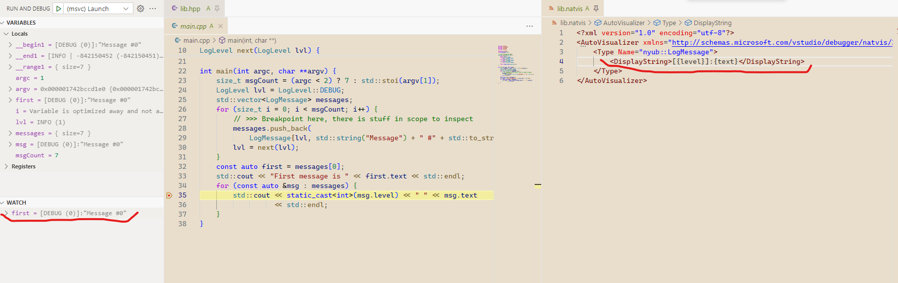

# Viz

Exploring test & debug visualisation options for C/C++ development.

Topics & Tools:

- Googletest's [printers](https://google.github.io/googletest/advanced.html#teaching-googletest-how-to-print-your-values)
- Microsoft's [Natvis framework](https://learn.microsoft.com/en-us/visualstudio/debugger/create-custom-views-of-native-objects?view=vs-2022)
- GDB's [Python pretty-printers](https://sourceware.org/gdb/current/onlinedocs/gdb.html/Writing-a-Pretty_002dPrinter.html)
- Loading a [custom printers DLL](viz.cpp) at debug time

## Googletest

Basically what is described in [Googletest documentation](https://google.github.io/googletest/advanced.html#teaching-googletest-how-to-print-your-values) works as expected.

### Attention points

- define the printer in the same namespace as the printed type

### Ideas

- The function implemented for assertions could be reused by the [shared debugging library](#custom-pretty-printing-library-loaded-at-debug) ?

## Natvis
Promising results




### Attention points

- Natvis process is EXTREMELY obscure and fails mostly silently.
- A bit more verbosity can be enabled by logging natvis error messages (which are extremely sparse)
```json
"logging": {
    "natvisDiagnostics": "verbose",
}
```
- xmlns: http **NOT** http**S**
- natvis xml properties are capitalized
```xml
    <!-- Ok -->
    <Type Name="nyub::LogMessage">
        <DisplayString>Hello</DisplayString>
    </Type>

    <!-- Not ok -->
    <Type Name="nyub::LogMessage">
        <DisplayString>Hello</DisplayString>
    </Type>
```

## GDB pretty-printers

TODO

## Custom pretty printing library loaded at debug

TODO